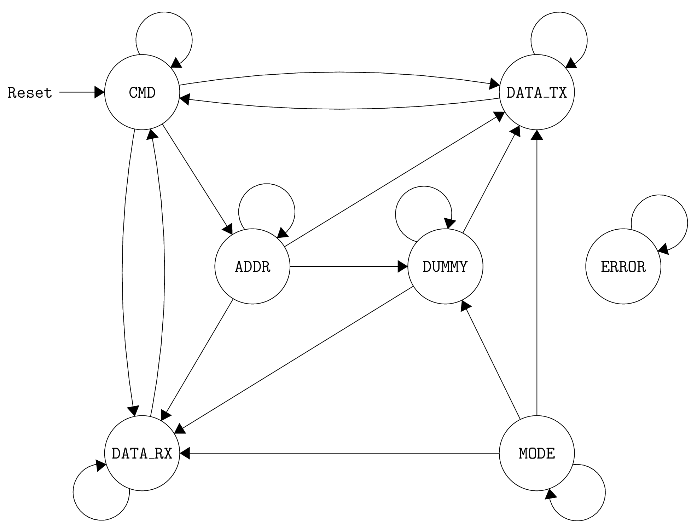

# AXI SPI Slave

This is an implementation of a simple SPI slave. The SPI slave can be used by
an external microcontroller to access the memory of the SoC where this IP is
instantiated. The SPI slave uses the AXI bus to access the memory of the target
SoC.

It contains dual-clock FIFOs to perform the clock domain crossing from SPI to
the SoC (AXI) domain.

This IP depends on some PULP common cells like clock muxes, clock gates and
clock inverters. Those can be found in the PULP common cells repository or in
the PULPino RTL sources. The clock domain crossing functionality is reused from
the AXI slice DC component, so make sure you compile the AXI slice DC when
using this IP.

## Operation

To read and write from/to memory/registers the following scheme has to be used.
First, an 8b opcode as specified below has to be transmitted by the master.
If memory is to be accessed a 32b address (MSB first) has to follow next.
The address of the register is encoded in the opcode.
In case of reads from memory there have to be 32 dummy cycles inserted next.
Eventually, the actual data is transmitted in the final 32b (MSB first again).

The slave controller is based on the FSM depicted below (yes, it contains unreachable states).

## Commands

The following opcodes are supported (cf. `spi_slave_cmd_parser.sv`):

| Opcode | Description      |
|:------:|------------------|
|  0x01  | Write Register 0 |
|  0x02  | Write Memory     |
|  0x05  | Read  Register 0 |
|  0x07  | Read  Register 1 |
|  0x0B  | Read  Memory     |
|  0x11  | Write Register 1 |
|  0x20  | Write Register 2 |
|  0x21  | Read  Register 2 |
|  0x30  | Write Register 3 |
|  0x31  | Read  Register 3 |

## Registers

The registers can be used to configure the slave but are mainly used internally and have sane defaults (cf. `spi_slave_regs.sv`).
They are nevertheless accessible via the opcodes above.

| Reg. | Description                          | Default |
|:----:|--------------------------------------|---------|
|   0  | Bit 0 enables QSPI                   |    0    |
|   1  | Number of dummy cycles               |   32    |
|   2  | AXI wrap length in byte (low byte)   |    0    |
|   3  | AXI wrap length in byte (high byte)  |    0    |
